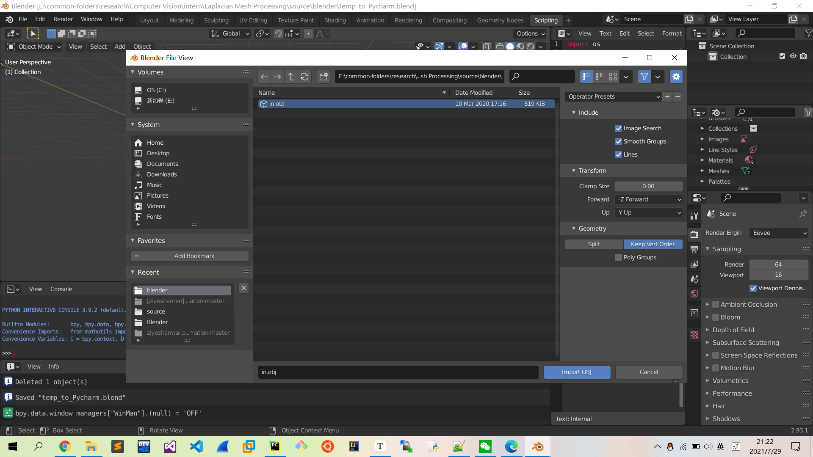
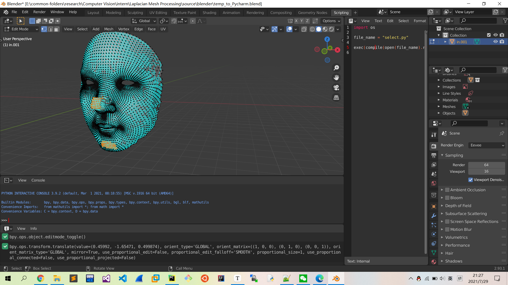
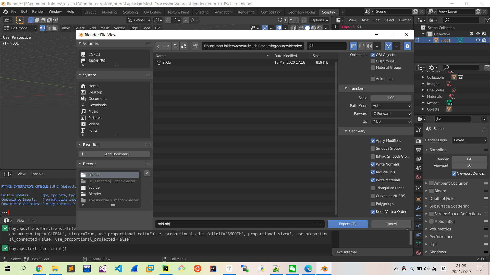
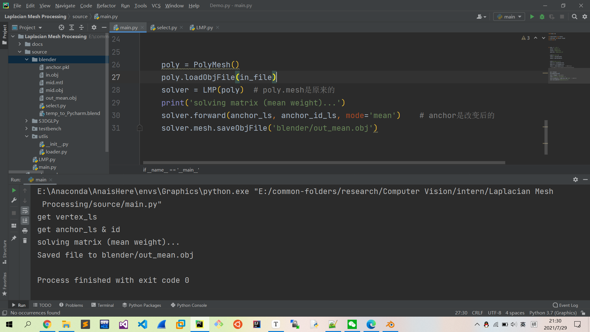
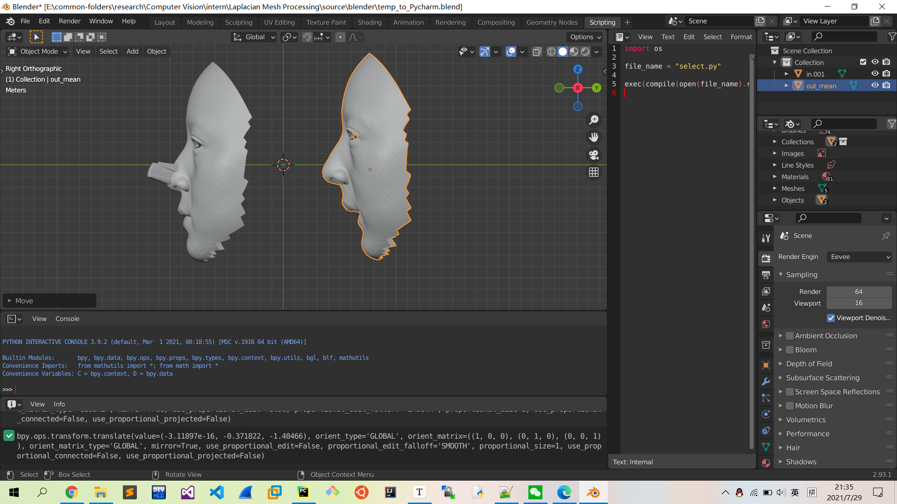
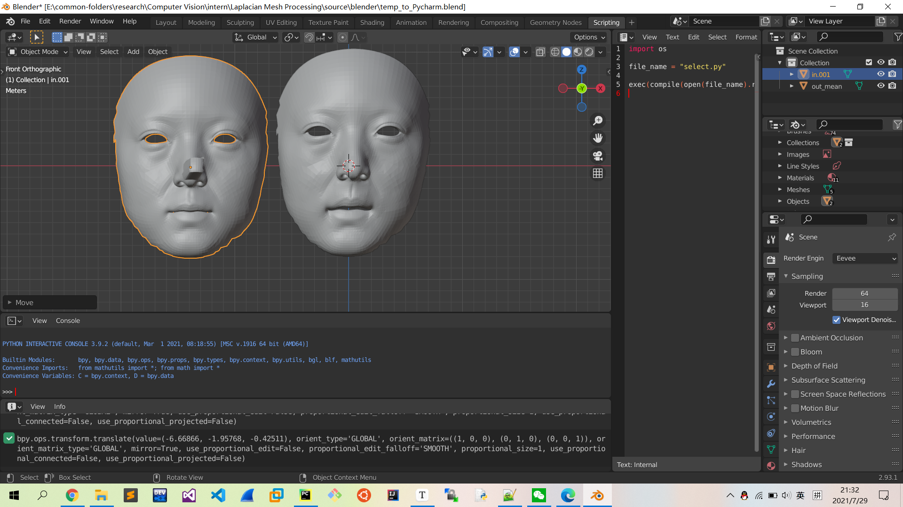
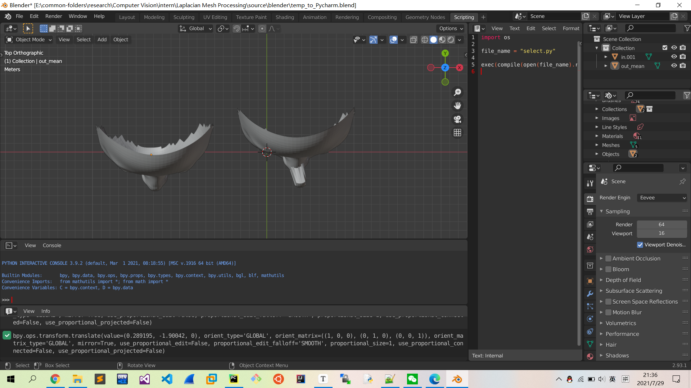
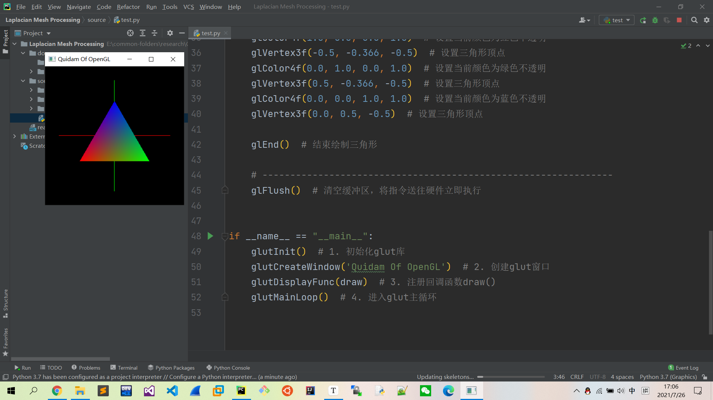
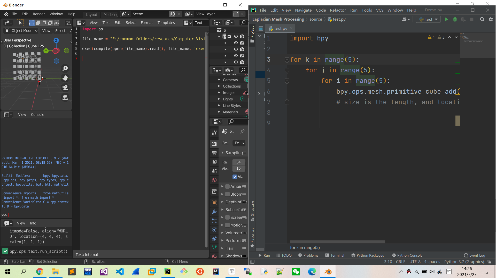
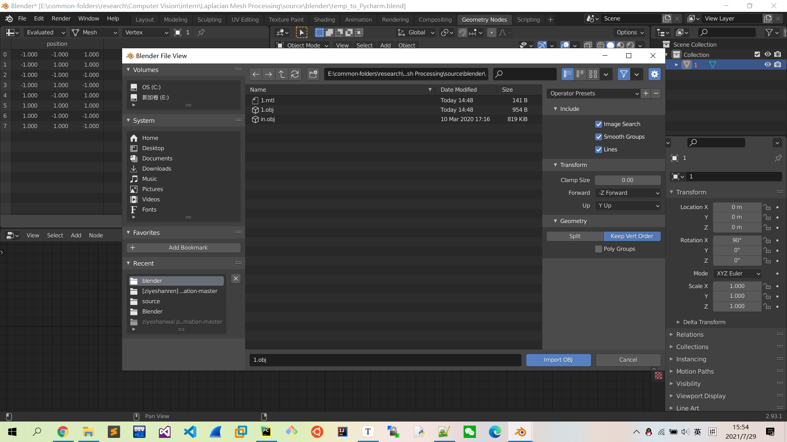

## Abstract

- Implemention of "Laplacian Mesh Deformation".

## Keyword

- Laplacian Mesh Deformation
- Blender
- least squares solution

## Usage

1. 使用`blender`软件打开`main.blend`.

2. 导入一个网格文件`in.obj`（注意要点选`Keep Vert Order`）。

   

3. 进入编辑模式（Edit Mode），画框选中锚点，按下快捷键`G`并移动鼠标拖拽使物体变形。

   

4. 打开`Scripting`栏，点击（或使用快捷键`ALT+P`）运行，保存所选择的锚点集`anchor.pkl`.

5. 导出变形后的网格文件`mid.obj`（注意要点选`Keep Vert Order`）。

   

6. 运行`main.py`，读取变形后的坐标集`mid.obj`以及锚点集`anchor.pkl`并计算出拉普拉斯网格变形后的点群坐标，保存到`out.obj`网格文件。

   

7. 使用`blender`导入输出网格文件`out.obj`，查看变形结果。

   1. 平均权重

      1. X视图

         

      2. Y视图

         

      3. Z视图

         

      4. 分析：

         - 锚点为变形点以及下巴，而变形结果也正是下巴固定，人脸的其余部分努力满足前伸的鼻子，而导致额头以及脸部呈流线型突出。

## Coding

- 文件目录结构

  - source
    - blender
      - `temp_to_Pycharm.blend`：使用blender打开，进行物体的变形和锚点选择。
      - `select.py`：存储所选择的锚点以及变形后的锚点坐标。
      - `in.obj`：初始物体
      - `mid.obj`：变形物体
      - `out_mean.obj`：平均权重变形结果
      - `out_cotan.obj`：CoTan权重变形结果
    - S3DGLPy
      - `PolyMesh.py`：Thanks to [Chris Tralie & ziyeshanwai](https://github.com/ziyeshanwai/python-laplacian-deformation).
    - testbench
      - `learn_bld.py`：学习blender基本操作
    - utils
      - `loader.py`：文件操作
    - `main.py`：主要流程
    - `LMP.py`：进行拉普拉斯方程的构建以及求解

- 开发思路

  - 使用Blender工业设计软件，将其与Pycharm进行连接，编写laplacian deformation算法。其中`S3DGLPy`部分为复用[Prof. Chris Tralie](https://github.com/bmershon/laplacian-meshes)的开发工具包（注：实际使用的是[ziyeshanwai](https://github.com/ziyeshanwai/python-laplacian-deformation)版本）。

- 开发过程

  1. ~~安装PyOpenGL库~~（本次实验未使用）

     1. 下载离线安装包，并使用pip命令

        ```
        pip install 存储位置\PyOpenGL-3.1.5-cp37-cp37m-win_amd64.whl
        ```

     2. 编写测试程序

        ```python
        # -*- coding: utf-8 -*-
        
        # -------------------------------------------
        # quidam_01.py 三维空间的世界坐标系和三角形
        # -------------------------------------------
        
        from OpenGL.GL import *
        from OpenGL.GLUT import *
        
        
        def draw():
            # ---------------------------------------------------------------
            glBegin(GL_LINES)  # 开始绘制线段（世界坐标系）
        
            # 以红色绘制x轴
            glColor4f(1.0, 0.0, 0.0, 1.0)  # 设置当前颜色为红色不透明
            glVertex3f(-0.8, 0.0, 0.0)  # 设置x轴顶点（x轴负方向）
            glVertex3f(0.8, 0.0, 0.0)  # 设置x轴顶点（x轴正方向）
        
            # 以绿色绘制y轴
            glColor4f(0.0, 1.0, 0.0, 1.0)  # 设置当前颜色为绿色不透明
            glVertex3f(0.0, -0.8, 0.0)  # 设置y轴顶点（y轴负方向）
            glVertex3f(0.0, 0.8, 0.0)  # 设置y轴顶点（y轴正方向）
        
            # 以蓝色绘制z轴
            glColor4f(0.0, 0.0, 1.0, 1.0)  # 设置当前颜色为蓝色不透明
            glVertex3f(0.0, 0.0, -0.8)  # 设置z轴顶点（z轴负方向）
            glVertex3f(0.0, 0.0, 0.8)  # 设置z轴顶点（z轴正方向）
        
            glEnd()  # 结束绘制线段
        
            # ---------------------------------------------------------------
            glBegin(GL_TRIANGLES)  # 开始绘制三角形（z轴负半区）
        
            glColor4f(1.0, 0.0, 0.0, 1.0)  # 设置当前颜色为红色不透明
            glVertex3f(-0.5, -0.366, -0.5)  # 设置三角形顶点
            glColor4f(0.0, 1.0, 0.0, 1.0)  # 设置当前颜色为绿色不透明
            glVertex3f(0.5, -0.366, -0.5)  # 设置三角形顶点
            glColor4f(0.0, 0.0, 1.0, 1.0)  # 设置当前颜色为蓝色不透明
            glVertex3f(0.0, 0.5, -0.5)  # 设置三角形顶点
        
            glEnd()  # 结束绘制三角形
        
            # ---------------------------------------------------------------
            glFlush()  # 清空缓冲区，将指令送往硬件立即执行
        
        
        if __name__ == "__main__":
            glutInit()  # 1. 初始化glut库
            glutCreateWindow('Quidam Of OpenGL')  # 2. 创建glut窗口
            glutDisplayFunc(draw)  # 3. 注册回调函数draw()
            glutMainLoop()  # 4. 进入glut主循环
        ```

     3. 运行测试程序

        

  2. ~~安装wxPython库~~（本次实验未使用）

     ```
     pip install -U wxPython
     ```

  3. 安装blender 2.93

  4. 连接pycharm和blender

     1. 按照[指示](https://b3d.interplanety.org/en/using-external-ide-pycharm-for-writing-blender-scripts/)，下载自动完成文件，并将其路径添加到Python解释器路径列表中。
  
     2. 完成之后，Pycharm能够识别`bpy`的自动补全。
  
     3. 在blender中编写模板文件，将其连接到pycharm脚本文件（在使用时需要填写目标的绝对路径）
  
        ```python
        import os
        
        file_name = "__dir__/learn_bld.py"
        
        exec(compile(open(file_name).read(), file_name, 'exec'))
        ```
  
     4. 查看效果，在pycharm中编写脚本文件后，在blender中点击运行，成功执行pycharm脚本文件中的内容
  
        
  
     5. 将模板blender保存到某目录中，以便后续使用。
  
  5. 编写测试脚本，熟悉Python和Blender的混合编程（`testbench/learn_bld.py`）
  
     ```python
     import bpy
     import bmesh
     
     
     '--- 生成cube阵列'
     # for k in range(5):
     #     for j in range(5):
     #         for i in range(5):
     #             bpy.ops.mesh.primitive_cube_add(size=0.5, location=[i, j, k])
     #             # size is the length, and location belongs to the center
     
     
     '--- 查看对象'
     # objs = bpy.context.selected_objects     # 获取所选对象列表
     # print(objs)
     # for obs in objs:
     #     print(obs.name, obs.location)   # 查看某对象的名字和位置
     
     
     '--- 选择对象'
     def select(name, additive=True):
         if not additive:
             bpy.ops.object.select_all(action='DESELECT')
             # action=['TOGGLE', 'SELECT', 'DESELECT', 'INVERT']
             # TOGGLE：全部取消选中，若已经全部取消选中，则全部选中
             # SELECT：全部选中
             # DESELECT：全部取消选中
             # INVERT：全部反转（原先选中的取消，原先取消的选中）
         bpy.data.objects[name].select_set(True)
     # select('Sphere')
     # bpy.ops.transform.translate(value=[-1, -1, 0])
     
     '--- 查看激活对象'
     # # 若有多个选中对象，则激活对象为最后被选中的对象
     # print(bpy.context.object)
     # print(bpy.context.active_object)    # 二者等效
     def activate(name):
         bpy.context.view_layer.objects.active = bpy.data.objects[name]
     # activate('Sphere')
     # print(bpy.context.object.name)
     # print(bpy.context.selected_objects)
     
     
     '--- 切换模式'
     def mode_set(mode):
         bpy.ops.object.mode_set(mode=mode)
         if mode == 'EDIT':
             bpy.ops.mesh.select_all(action='DESELECT')  # 进入编辑模式时，对于所激活对象的所有点都不进行选中，更加安全
     # mode_set('EDIT')
     
     
     '--- 尝试使用bmesh'
     # bpy.ops.mesh.primitive_cube_add(size=2, location=[0, 0, 0])
     # bpy.ops.object.mode_set(mode='EDIT')    # 添加一个cube并进入编辑模式
     
     
     '--- 轻微形变'
     def clear():
         # 如果画布本身为空，则调用该函数会报错
         bpy.ops.object.mode_set(mode="OBJECT")  # 首先要进入对象模式
         bpy.ops.object.select_all(action="SELECT")
         bpy.ops.object.delete()
     # clear()
     # bpy.ops.mesh.primitive_cube_add(size=1, location=[3, 0, 0])
     # bpy.ops.object.mode_set(mode='EDIT')
     # bpy.ops.mesh.select_all(action='SELECT')
     # bpy.ops.transform.vertex_random(offset=0.5)     # 对所有顶点进行随机偏移
     # bpy.ops.object.mode_set(mode='OBJECT')
     ```
  
  6. 开发LMP项目。

## Conclusion

- blender与其导出的obj文件中节点的顺序不一致。

  - 并且经实验发现，blender的z轴方向是反的。

  - 解决办法（[issue](https://github.com/ziyeshanwai/python-laplacian-deformation/issues/1#issuecomment-792409529)）：在import .obj文件时，必须点选`Keep Vert Order`，使节点保序；并且，export时也将其选中。

    

## Future

- cotan权重计算

## References

- [Windows环境下在Pycharm中使用OpenGL](https://www.pianshen.com/article/16471658699/)

- [opengl教程](https://blog.csdn.net/xufive/article/details/86565130)

- [Pycharm连接Blender](https://b3d.interplanety.org/en/using-external-ide-pycharm-for-writing-blender-scripts/)

- [Blender Python API -cn](https://github.com/BlenderCN/blenderTutorial/blob/master/theBlenderPythonApi/README.md)

- [code of Chris Tralie](https://github.com/bmershon/laplacian-meshes)

- [code of ziyeshanwai](https://github.com/ziyeshanwai/python-laplacian-deformation)

- [Principle of Laplacian](https://blog.csdn.net/z136411501/article/details/107622967)

- [Tutorial of Laplacian Mesh Editing](http://www.ctralie.com/Teaching/LapMesh/#download)

